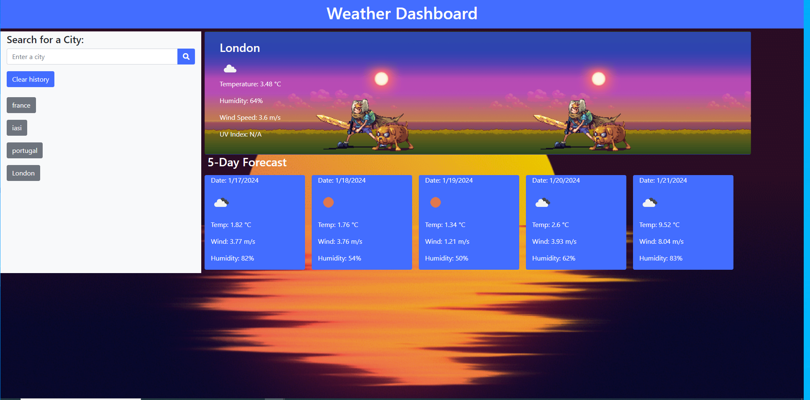

# Weather Dashboard

## Description

A weather dashboard application that allows users to search for the current and future weather conditions of a city. The application displays the current weather information, including the city name, date, weather icon, temperature, humidity, and wind speed. Additionally, it provides a 5-day forecast with date, weather icon, temperature, and humidity. The search history is stored, and users can click on a city in the history to view its weather conditions again.

## Features

- Search for the current and future weather conditions of a city.
- Display the current weather information: city name, date, weather icon, temperature, humidity, and wind speed.
- Show a 5-day forecast with date, weather icon, temperature, and humidity.
- Store search history and allow users to view weather conditions for previously searched cities.
- Default search for London on page load.

## Technologies Used

- HTML
- CSS (Bootstrap)
- JavaScript
- OpenWeatherMap API

## Usage

- Enter a city name in the search input and click the search button.
- View the current weather conditions and 5-day forecast for the selected city.
- Click on a city in the search history to view its weather conditions again.
- Use the "Clear history" button to clear the search history.

# [Repository](https://github.com/fishmon/WeatherCheck)

# [Deployed aplication](https://fishmon.github.io/WeatherCheck/)

